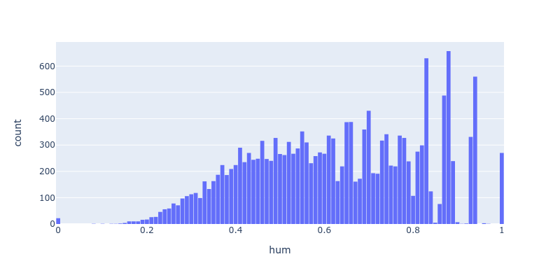
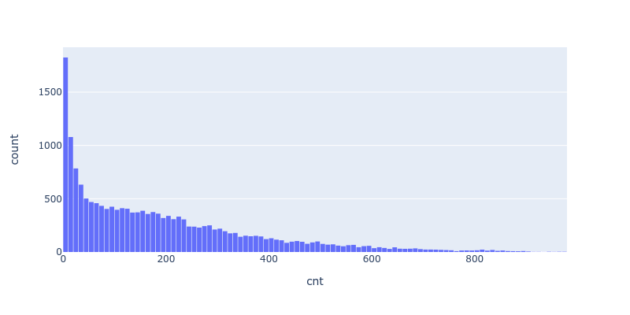

# Deep Learning Nanodegree - Project 1

# Bike-Sharing Patterns Prediction

This project develops a neural network for predicting bike sharing patterns of a rental company over a year.

This is the 1st project in Udacity's Deep Learning Nanodegree [1][2]. This README serves as a final report for the project.

 

NOTE. The objective of this project was to familiarize students with the maths inside a neural network, such as feedforwarding, backpropagation and loss calculation. For this reason, the neural network was kept simple and had to be coded "from scratch". Toolkits such as PyTorch, Tensorflow or Keras could not be used.

---
# TABLE OF CONTENTS

[SETUP](#setup)

- [Install](#install)
- [Usage](#usage)
- [Project Files](#project-files)

[PROBLEM](#problem)

- [Customer Needs](#customer-needs)
- [Requirements](#requirements)

[DATA](#data)

- [Input Data](#input-data)
- [Data Exploration](#data-exploration)
- [Data Cleaning](#data-cleaning)

[DESIGN](#design)

- [Pipeline](#pipeline)
- [Feature Engineering](#feature-engineering)
- [Data Loader](#data-loader)
- [Data Pre-Processor](#data-preprocessor)
- [Neural Network](#neural-network)
- [Training](#training)
- [Testing](#testing)

[IMPLEMENTATION](#implementation)

[CONCLUSION](#conclusion)

- [Possible Improvements](#possible-improvements)

[APPENDIX](#appendix)

- [Accronyms](#accronyms)
- [Symbols](#symbols)
- [References](#references)


---

# SETUP

### Install

1 - Clone this repository.

	$ cd ~
	$ git clone https://github.com/martin0004/bike_sharing_patterns.git

2 - Install miniconda.

	$ https://docs.conda.io/en/latest/miniconda.html

3 - Create conda environment for this project.

	$ cd ~/bike_sharing_patterns/install
	$ conda env create --file environment.yaml   # Creates "bike" environment

4 - Activate environment.

	$ conda activate bike


### Usage


```

from bikesharing import *
import pickle

# Load data

dl = DataLoader()
df_data = dl.load("testme.csv")

# Pre-process data.

dpp = DataPreprocessor(MEANS, STDS)
df_features = dpp.run(df_data)

# Load neural network

with open("model.pkl", "rb") as f:
    nn = pickle.load(f)

# Make predictions

predictions = nn.run(df_features)

# Plot predictions

timestamps = get_timestamps_from_df_data(df_data)
plot_predictions(predictions, MEANS, STDS, timestamps)

```

This will load a chart of predictions in your browser.

 


### Project Files

```
data/                                 Training dataset.
    day.csv                           Bike rental data for each day (not used in project).
    hour.csv                          Bike rental data for each hour (used in project).

dev/
    data.ipynb                        Notebook for exploring data.
    design.ipynb                      Notebook for developing machine learning pipeline.
    implementation.ipynb              Notebook for running machine learning pipeline.
    
images/                               Images for the README.

src/
    bikesharing.py                    Neural network and supporting classes/functions.
    model.pkl                         Trained neural network.
    testme.csv                        Dummy data for testing neural network.

```


---
# PROBLEM

# Customer Needs

Cycle Hop, a bike-sharing company, wants to predict how many bicycles it will need in the future (typically in the next 21 days). If the company has too few bicycles, it misses potential riders. If it has too many, it is wasting money on bikes that are just sitting around.

 

# Requirements

- Build a simple neural network which can predict bike-sharing patterns based on historical data.


---
# DATA

# Input Data

The neural network in this project is trained using bike rental data between years 2011 and 2012 from the Capital Bikeshare Company [3]. The dataset contains 17379 entries and is available in file `hour.csv`.

 


# Data Exploration

### Features

The dataset contains the following features.

| Feature    | Type         | Values                                       | Description                                 |
|------------|--------------|----------------------------------------------|---------------------------------------------|
| instant    | numerical    | 1-17379                                      | Record index.                               |
| dteday     | categorical  | 2011-01-01 tru 2012-12-31                    | Date of record.                             |
| season     | categorical  | 1 (winter), 2 (spring), 3 (summer), 4 (fall) | Season of record.                           |
| yr         | categorical  | 0 (2011), 1 (2012)                           | Year of record.                             |
| mnth       | categorical  | 1 (January) to 12 (December)                 | Month of record.                            |
| hr         | categorical  | 0 tru 23                                     | Hour of record.                             |
| holiday    | categorical  | 0 (not holiday), 1 (holiday)                 | Whether day is holiday or not.              |
| weekday    | categorical  | 0 (Sunday) to 6 (Saturday) (*)               | Weekday of rental.                          |
| workingday | categorical  | 0 (weekend or holiday), 1 (workday)          | Whether day is workday or not.              |
| weathersit | categorical  | 1 (clear), 2 (mild), 3 (light) 4 (heavy)     | Weather severity.                           |
| temp       | numerical    | 0-1                                          | Normalized temperature in oC (**).          |
| atemp      | numerical    | 0-1                                          | Normalized feeling temperature in oC (***). |
| hum        | numerical    | 0-1                                          | Normalized humidity %.                      |
| windspeed  | numerical    | 0-1                                          | Normalized windspeed (max = 67)             |
| casual     | numerical    | 0-367                                        | Count of casual users.                      |
| registered | numerical    | 0-886                                        | Count of registered users.                  |
| cnt        | numerical    | 1-977                                        | Total count of users (count + registered).  |

(\*) Reference [3] does not state exactly which number is which week day. By opening file `hour.csv` in was possible to see 0=Sunday and 6=Saturday using the date in column `dteday`. <br>
(\*\*) temp = (t-t_min) / (t_max-t_min), t_min=-8, t_max=+39 [3] <br>
(\*\*\*) temp (t-t_min)/(t_max-t_min), t_min=-16, t_max=+50 [3]

### Feature Distributions & Time Series

Below are value distributions and time series for each feature in the dataset (features "instant" and "dteday" not shown).

<table>
    <tr>
        <td></td>
        <td></td>
    </tr>
    <tr>
        <td></td>
        <td></td>
    </tr>
    <tr>
        <td></td>
        <td></td>
    </tr>
    <tr>
        <td></td>
        <td></td>
    </tr>
    <tr>
        <td></td>
        <td></td>
    </tr>
    <tr>
        <td></td>
        <td></td>
    </tr>
    <tr>
        <td></td>
        <td></td>
    </tr>
    <tr>
        <td></td>
        <td></td>
    </tr>
    <tr>
        <td></td>
        <td></td>
    </tr>
    <tr>
        <td></td>
        <td></td>
    </tr>
    <tr>
        <td></td>
        <td></td>
    </tr>
    <tr>
        <td></td>
        <td></td>
    </tr>
    <tr>
        <td></td>
        <td></td>
    </tr>
    <tr>
        <td></td>
        <td></td>
    </tr>
    <tr>
        <td></td>
        <td></td>
    </tr>    
</table>


### Missing Values

The dataset contains no missing values.

# Data Cleaning

No data cleaning was required on the dataset of this project.

---
# DESIGN

# Pipeline

The neural network developped in this project is part of a machine learning pipeline. The components of this pipeline are illustrated below.

 

# Feature Engineering

The training dataset contained enough features for developping the neural network. No new feature was developped.

However, only about 50 % of the original features were kept for training the network. Other features were deemed redundant or irrelevant. The features selected are listed below.

	 season, yr, mnth, hr, holiday, weathersit,
	 weekday, temp, hum, windspeed

And the following feature is used as our target.

	cnt


# Data Loader

The data loader reads rental data from a csv file stores it in a DataFrame.

	dl = DataLoader()
	df_data = dl.load("path/to/file")	

# Data Pre-Processor

### Overview

The data pre-processor formats the dataset raw data so it can be manipulated by the neural network.

- The pre-processor performs scaling of some features. Means and standard deviations are stored in global variables MEANS and STDS (dictionnaries).

	```
	dpp = DataPreprocessor(MEANS, STDS)
	```

- If the dataset contains targets, pre-processing can be performed on both the features and targets. Just use argument `targets=True` when running the preprocessor. Use this functionnality when preparing training data.

	```
	df_features, df_targets = dpp.run(df_data, targets=True)
	```

- If the dataset only contains features, run the data pre-processor without using the `targets` argument. Use this when only performing predictions.

	```
	df_features = dpp.run(df_data)
	```

### Features

The data pre-processor performs the following transformations on features.

 


### Targets

Targets are simply scaled.

 

# Datasets

The bike rental data dataset was split into training, validation and testing datasets. The data split is described in the table below.

| datasets   | data_points   | %_total   | Note               |
|:-----------|:--------------|:----------|--------------------|
| train      | 15435         | 88.81     | Data over 2 years. |
| valid      | 1440          | 8.29      | 60 days of data.   |
| test       | 504           | 2.90      | 21 days of data.   |
| -          | -             | -         |                    |
| total      | 17379         | 100.00    |                    |

# Neural Network

The neural network architecture was kept simple.

- Fully connected layers.
- One input layer
	- About 50 nodes, one for each pre-processed features.
- One hidden layer
	- Number of nodes = hyperparameter.
	- Activation function = sigmoid.
- One output layer
	- 1 node = predicted # of bike rental for a specific hour (scaled))

 

# Training

### Criteria

The neural network training is performed using the following criteria.

| Criteria         | Description        | Value                                 |
|------------------|--------------------|---------------------------------------|
| Error Function   | Mean squared error |  |
| Metrics          | Training loss      | <= 0.09 (*)                           |
|                  | Validation loss    | <= 0.18 (*)                           |
| Batching         | Mini-Batches       | 128 data points                       |

(*) Metrics values provided by Udacity. [2]

### Hyperparameter Search

An hyperparameter search was run on the neural network. Results are listed below. Run #7 was 
selected as the best combination of hyperparameters.

| run    |epochs        | hidden_nodes  | learning_rate |  train_loss | valid_loss | Note |
|--------|--------------|---------------|---------------|-------------|------------|------|
| 0      | 5000         | 10            | 0.01          | 0.415833    | 0.690948   |      |
| 1      | 5000         | 25            | 0.01          | 0.443986    | 0.723633   |      |
| 2      | 5000         | 30            | 0.01          | 0.425169    | 0.697520   |      |
| 3      | 5000         | 10            | 0.10          | 0.251146    | 0.419924   |      |
| 4      | 5000         | 25            | 0.10          | 0.255440    | 0.430313   |      |
| 5      | 5000         | 30            | 0.10          | 0.259442    | 0.444519   |      |
| 6      | 5000         | 10            | 0.50          | 0.077379    | 0.174372   |      |
| 7      | 5000         | 25            | 0.50          | 0.062062    | 0.153978   | best |
| 8      | 5000         | 30            | 0.50          | 0.063339    | 0.143378   |      |

 

# Testing

The trained model was ran on the testing dataset (last 21 days of the original data). Predictions are illustrated below.

 


---
# IMPLEMENTATION

The pipeline described above (data loader, data pre-processor and neural network) was coded in file `bikesharing.py` .

The trained neural network was saved in file `model.pkl`.

Refer to section "Usage" for instructions on how to run the network on new data.

---
# DEPLOYMENT

This model was kept as a stand-alone application and not deployed to the cloud.

---
# CONCLUSION


### Possible Improvements

- Improve the neural network class so any number of hidden layers can be specified by the user.

---
# APPENDIX

### Accronyms

| Accronym | Description        |
|----------|--------------------|
| MSE      | Mean Squared Error |

### Symbols

| Symbol | Description                      | Size   |
|--------|----------------------------------|--------|
| m      | Number of data points in a batch | Scalar |
| μ      | Index of data point in a batch   | Scalar |
| y      | Target real value                | Scalar |
| Y      | Target real value                | Vector |
| ŷ      | Target predicted value           | Scalar |
| Ŷ      | Target predicted value           | Vector |


### References

[1] Udacity, Deep Learning Nanodegree, https://www.udacity.com/course/deep-learning-nanodegree--nd101

[2] Udacity, Bike Sharing Project, https://github.com/udacity/deep-learning-v2-pytorch/tree/master/project-bikesharing

[3] UCI Machine Learning Repository, Bike Sharing Dataset, https://archive.ics.uci.edu/ml/datasets/Bike+Sharing+Dataset#

[4] Task, Andrew W., Grokking Deep Learning, Manning Editions.


